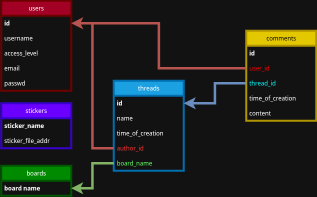

# Holywar Stack Exchange

Holywar Stack Exchange is a discussion board website for operating systems and general computer enviroments. Built in the style of imageboards but with a bit of a modern spin. Site will be split into number of dedicated boards where users are expected to talk about ricing and operating systems design, share memes and software, argue about OSes and why emacs is better then vim and, of course, shitpost.

---

## Main Features

### User Profiles
Every user can register a public profile, showing all their latest activity.

### Boards and Threads
Boards organize discussions by topic. Each board contains multiple threads created by users. A thread represents one topic of discussion.

### Search
Search functionality is available at three:
- Within a board, users can search by thread titles.
- Within a thread, users can search for specific words in messages.
- Search for a user by their username.

### Stickers and Inline Images
Users can add some predifined stickers or images from the web
- To add a sticker, put its name in colons :likeThis:
- To add an image, do the same with link :https://likethis.com/someimg.png:

### Anonymous posting
In the spirit of traditional imageboards, users can use anonymous profiles to make threads or post comments. However they will not be able to use stickers or images like signed in users.

---

## Planned API Endpoints

| Method | Endpoint | Description | Body | response |
|--------|-----------|-------------| ---- |---------|
| `POST` | `/register` | Create a new user profile | username, password, email | 201, created |
| `POST` | `/login` | Sign in your user profile | email, password |  | 202, probably token |
| `GET` | `/profiles/:username` | View user profile information |  | 200, user information or 204 if nothing found |
| `GET` | `/profiles/search` | Search for a user | username | 200 or 204 |
| `GET` | `/boards/:board_name` | Retrieve all threads in a board |  | 200 |
| `GET` | `/boards/:board_name/:page` | Retrieve all threads in a board on a select page |  | 200 |
| `POST` | `/boards/:board_name/makethread` | Create a new thread | name, contents | 200 |
| `GET` | `/boards/:board_name/threads/:thread_name` | View a thread and its comments |  | 200 |
| `POST` | `/boards/:board_name/threads/:thread_name` | Add a comment | contents | 201 |
| `GET` | `/boards/:board_name/threads/:thread_name/:page` | View select comment page |  | 200 |
| `GET` | `/boards/:board_name/search` | Search thread titles | title | 200 or 204 |
| `GET` | `/boards/:board_name/threads/:thread_name/search` | Search thread comments | string | 200 or 204 |

---

## Database Diagram

